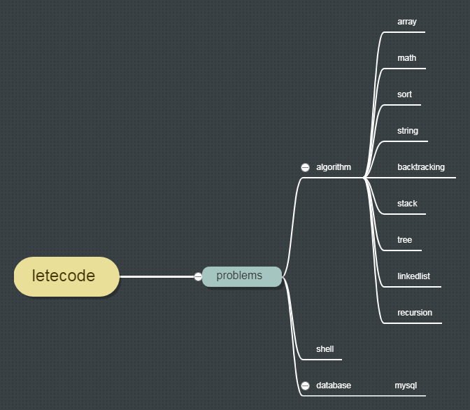

#version java jre "1.8" 

#code : GBK GBK GBK 
	由于一开始写的时候没在意编码格式，等发现字符集是GBK 时，已经写了好多，也就不太想修改字符集，所以本项目以后将一致延续这种风格,�澹�不要在意这些细节啦！！！发现emoji 用GBK还不能保存，果然在项目开始定好字符集还是很有意义的...

<<<<<<< HEAD 
#这是一个letecode的文档 
--
#首先maven项目 ，可以直接下载导入本地编辑器。如果想要测试代码，请在 [letecode](https://leetcode.com/)查看题目描述及测试 

#包命名方式：order by tags

#文件命名方式：方法名+题目标号

#[更新连接](https://github.com/small-Teenager/letecode-study.git)

  
