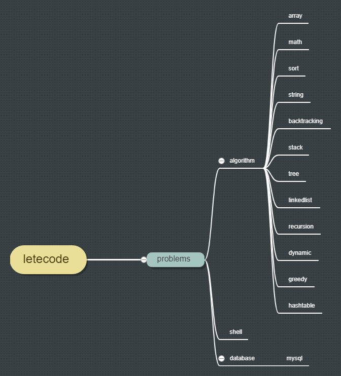

#version java jre "1.8" 

#code : UTF-8 

<<<<<<< HEAD 
# this is a doc for letecode
--
#if you want to test the code,please [letecode](https://leetcode.com/)chack and test

#package name：order by tags

#text name：method name +title label

#[link](https://github.com/small-Teenager/letecode.git)

#[Java](https://www.processon.com/view/link/5e5e4b5be4b0f8585545e6a8#map)

  
